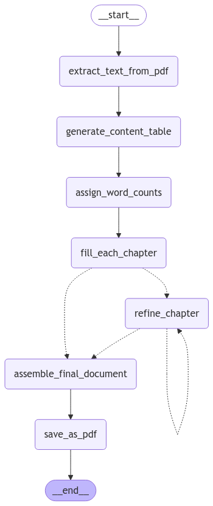

# generative_transcript_transformation

## Overview

`generative_transcript_transformation` is a project designed to generate educational transcripts from PDF files. The pipeline extracts text from a PDF, generates a content table, assigns word counts to each section, fills each chapter with content, assembles the final document, and saves it as a PDF file.

## Important Files

- `pipeline.py`: Contains the `TranscriptPipeline` class which defines the entire pipeline process.
- `prompts.py`: Contains the prompt templates used by the language model to generate and refine content.
- `README.md`: This file, providing an overview and instructions for the project.

## Pipeline Logic

The pipeline is built using a state graph, where each node represents a step in the process:

1. **Extract Text from PDF**: Extracts text from the provided PDF file.
2. **Generate Content Table**: Creates a structured content table from the extracted text.
3. **Assign Word Counts**: Assigns word counts to each section based on their importance.
4. **Fill Each Chapter**: Generates detailed content for each chapter.
5. **Refine Chapters**: Optionally refines chapters that need additional content.
6. **Assemble Final Document**: Combines all chapters into a final document.
7. **Save as PDF**: Converts the final document into a PDF file.

## How to Use the App

1. Ensure you have the necessary environment variables set up, particularly the `OPENAI_API_KEY`.
2. Initialize the pipeline with the required start state.
3. Run the pipeline to generate the educational transcript.
4. The final document will be saved as `output_file.pdf`.

## Deployment

The app is deployed using Streamlit. You can access it via the following link:

[Deployed App Link](https://appapppy-b6r722hxkrroxdh64cxvzr.streamlit.app/)